echo '# 🏢 Intrasync - Internal Company Portal for HR & Team Operations

**Intrasync** is a full-stack internal enterprise platform designed to centralize and streamline core HR and employee operations.  
It supports workflows like employee management, daily work updates, resignations, event announcements, ticket tracking, and more — helping teams collaborate efficiently and enabling HR to manage operations digitally.

---

## 📋 Table of Contents

-   [🚀 Features](#-features)
-   [🛠️ Technologies Used](#-technologies-used)
-   [📥 Installation](#-installation)
-   [▶️ Usage](#-usage)
-   [📂 Folder Structure](#-folder-structure)
-   [📸 Screenshots](#-screenshots)
-   [🤝 Contributing](#-contributing)
-   [📜 License](#-license)

---

## 🚀 Features

-   **User Login & Authentication**
    -   JWT-based session management
-   **Employee Directory**
    -   Add, edit, filter, and manage employee profiles
-   **Daily Update of Work**
    -   Employees log their daily tasks and total hours
-   **Ticket Management System**
    -   Employees can raise, update, and track tickets
    -   HR/Admin can manage ticket status
-   **Resignation Workflow**
    -   Submit and process resignation applications
-   **Event Announcements**
    -   Post and manage internal company events
-   **Role-Based Access Control**
    -   Admin, HR, and Employee roles with permission-based access

---

## 🛠️ Technologies Used

### 🔧 Backend

-   **Node.js** – Server-side JavaScript runtime
-   **Express.js** – Web framework for APIs and routing
-   **PostgreSQL** – Relational database
-   **Sequelize** – ORM for schema & data modeling
-   **JWT** – Secure token-based authentication
-   **Handlebars (HBS)** – Email templating engine

### 💻 Frontend

-   **React.js** – Modern component-based frontend framework
-   **React Router** – Routing for single-page application
-   **Axios** – API communication
-   **CSS** – UI styling (component & global)

---

## 📥 Installation

### 1. Clone the repository

```bash
git clone https://github.com/your-org/intrasync.git
cd intrasync
```

### 2. Install backend dependencies

```bash
npm install
```

### 3. Configure environment variables

Create a \`.env\` file in the root and add:

```bash
DB_HOST=localhost
DB_USER=youruser
DB_PASS=yourpass
DB_NAME=intrasync
JWT_SECRET=your_jwt_secret
EMAIL_USER=your_email@example.com
EMAIL_PASS=your_email_password
```

### 4. Run DB migrations & seeders

```bash
npx sequelize-cli db:migrate
npx sequelize-cli db:seed:all
```

### 5. Start backend server

```bash
npm start
```

---

## ▶️ Usage

-   React frontend runs separately on [`http://localhost:3001`](http://localhost:3001)
-   Backend API runs on [`http://localhost:3000`](http://localhost:3000)
-   Make sure to configure a proxy in your React frontend (`package.json`) to forward API calls:

````json
"proxy": "http://localhost:3000"
````
---

## 📂 Folder Structure

```bash
project-root/
├── app.js                           # Entry point
├── config/
│   └── config.js                    # DB & env config
├── migrations/                      # Sequelize migration files
├── models/                          # Sequelize models
├── seeders/                         # DB seed files
├── src/
│   ├── controllers/                 # Business logic
│   ├── database/                    # DB connection
│   ├── emails/templates/           # Handlebars templates
│   ├── helper/                      # Utility functions
│   ├── middleware/                  # Auth middleware
│   ├── repository/                  # Data access layer
│   └── router/                      # Express routes
````

React frontend (example):

```bash
client/
├── src/
│   ├── api/
│   ├── assets/
│   ├── components/
│   ├── pages/
│   ├── routes/AppRoutes.jsx
│   └── index.js
```

---

## 📸 Screenshots

### 🔐 Intrasync Login

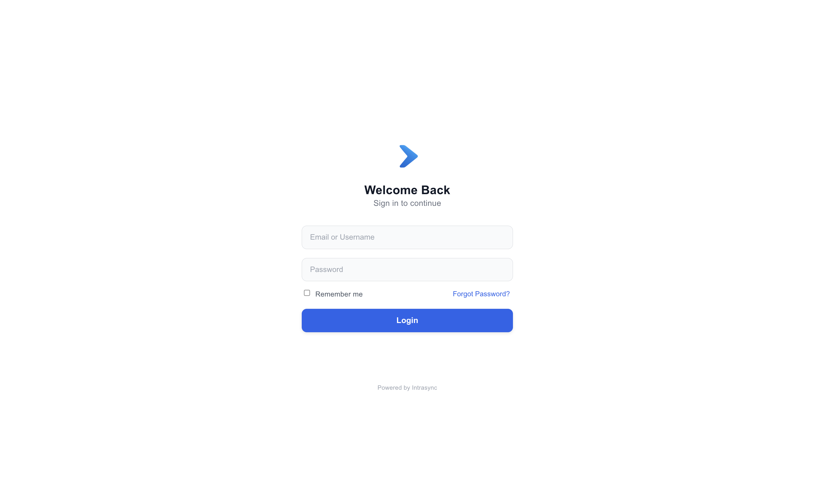

### 🔑 Forgot Password

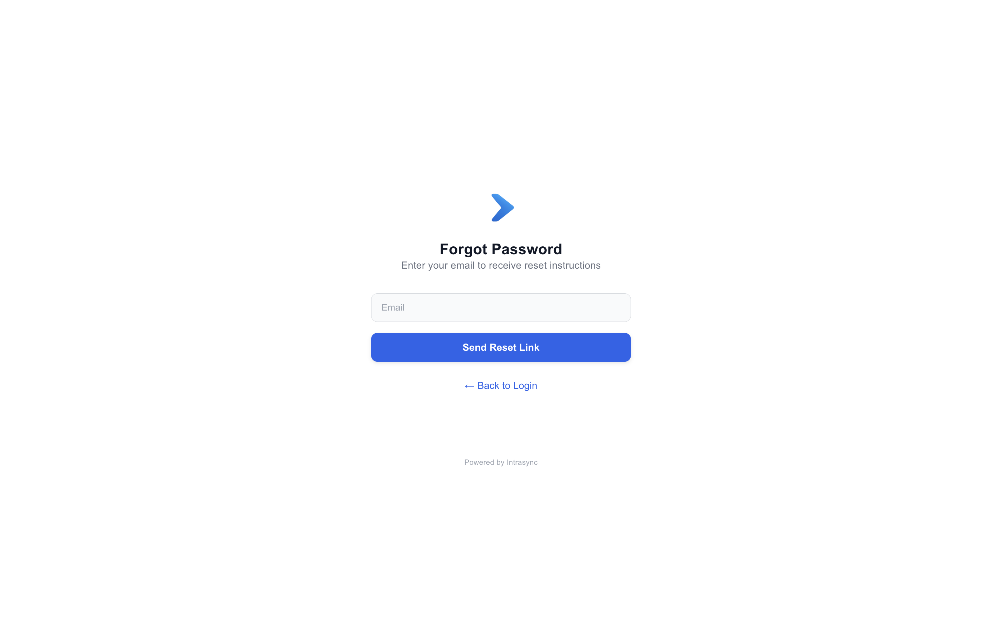

### 🏠 Home Page

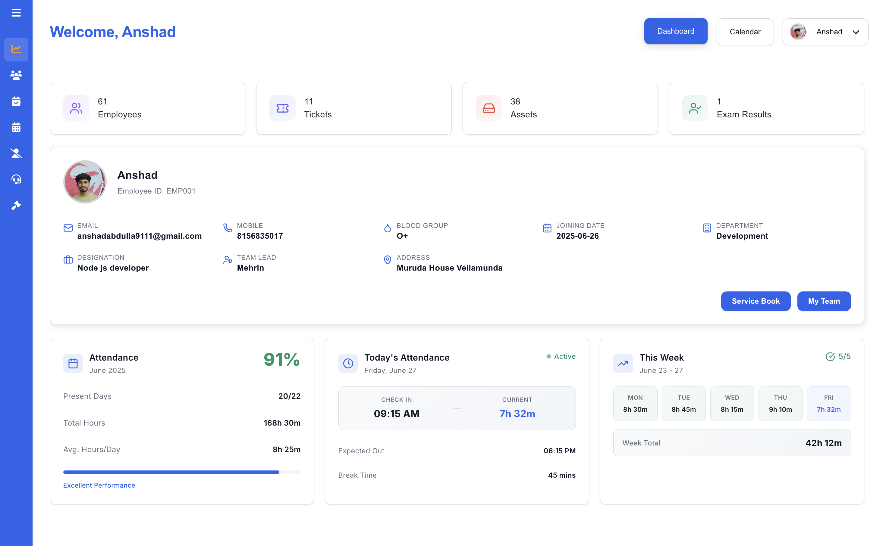

### 👥 Employee Directory

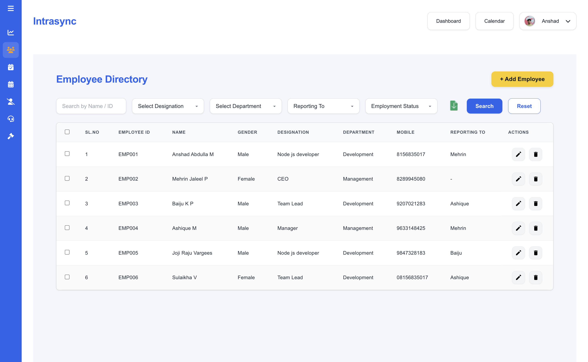

### ➕ Add Employee

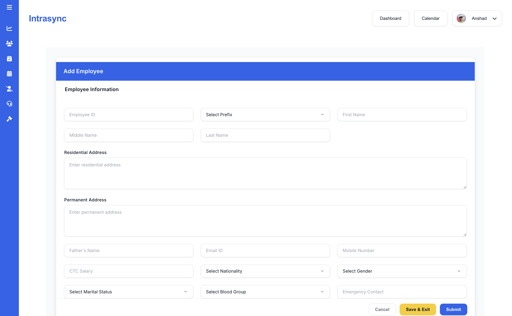

### 🖊️ Update Employee

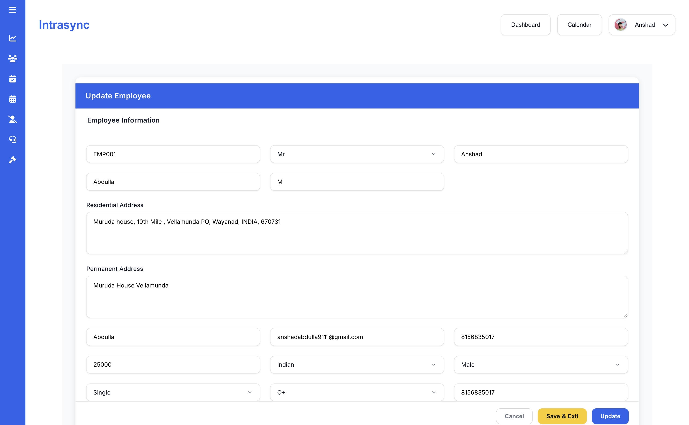

### 🎫 Ticket List

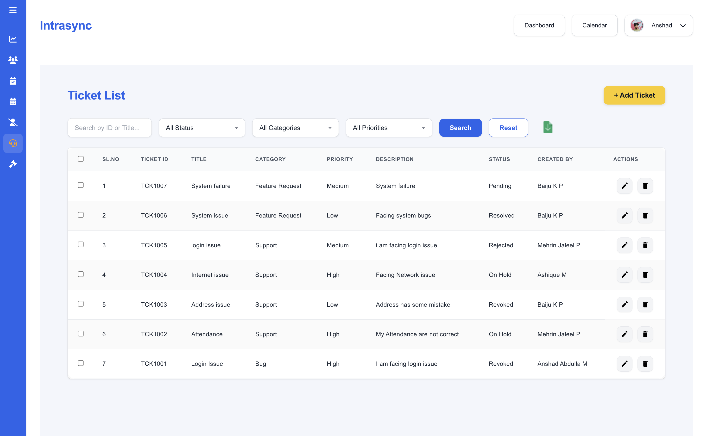

### ✏️ Update Ticket

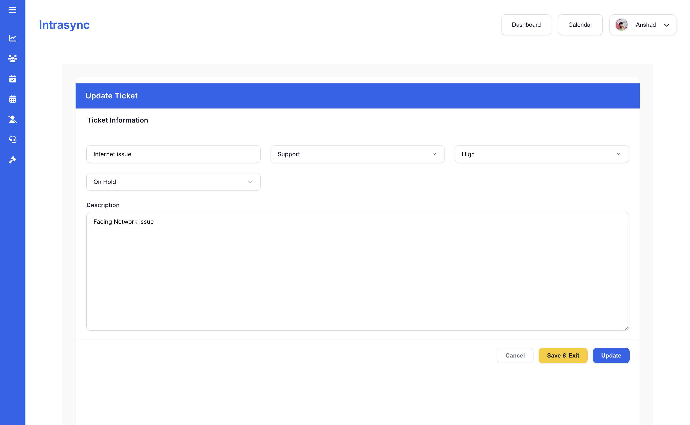

### 📅 Daily Updates

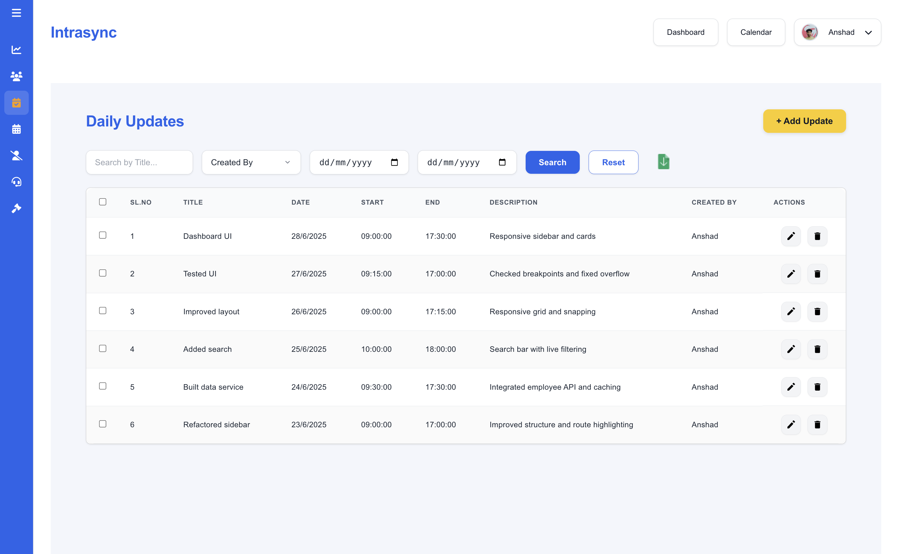

### 🆕 Create Daily Update

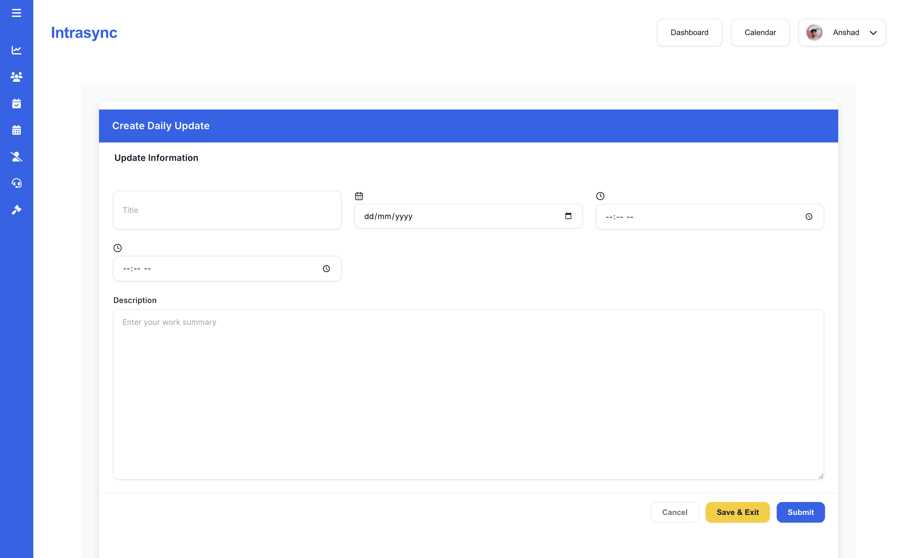

### 🔁 Edit Daily Update

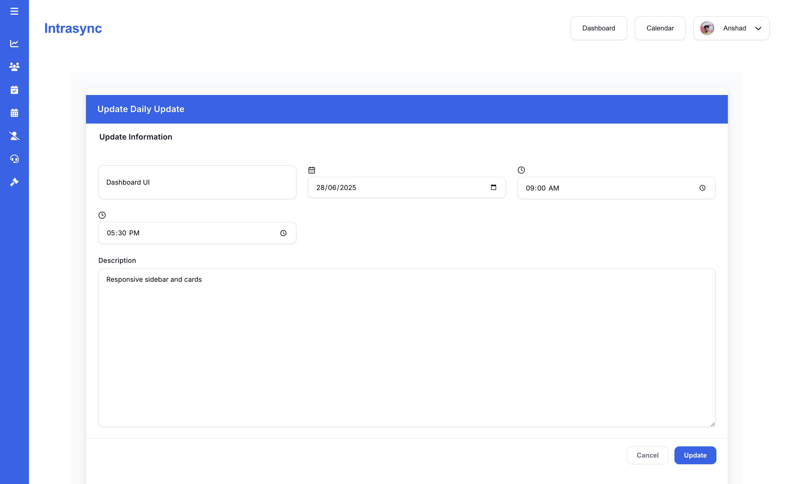

### 🔐 Reset Password

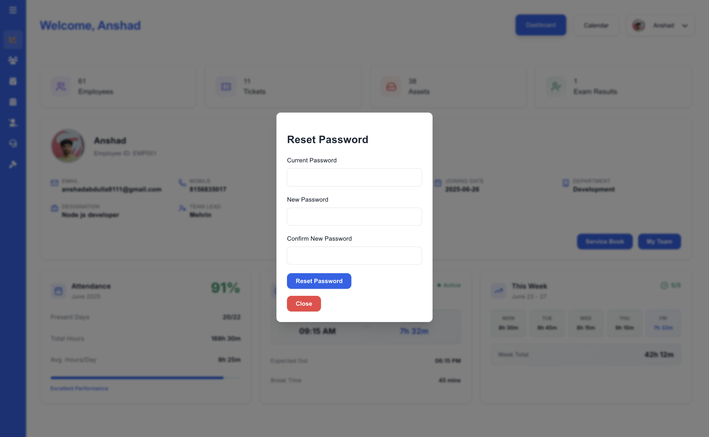

### 📧 Forgot Password Email Template

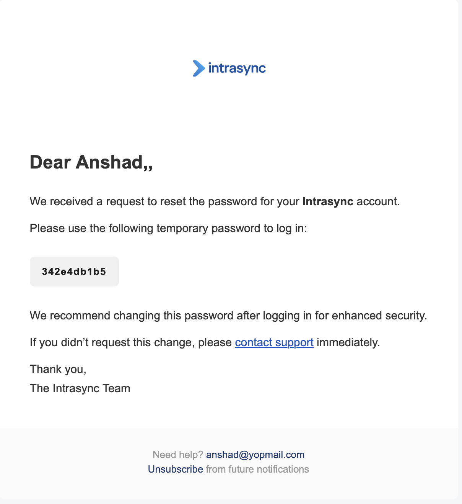

### ✅ Reset Password Success Email

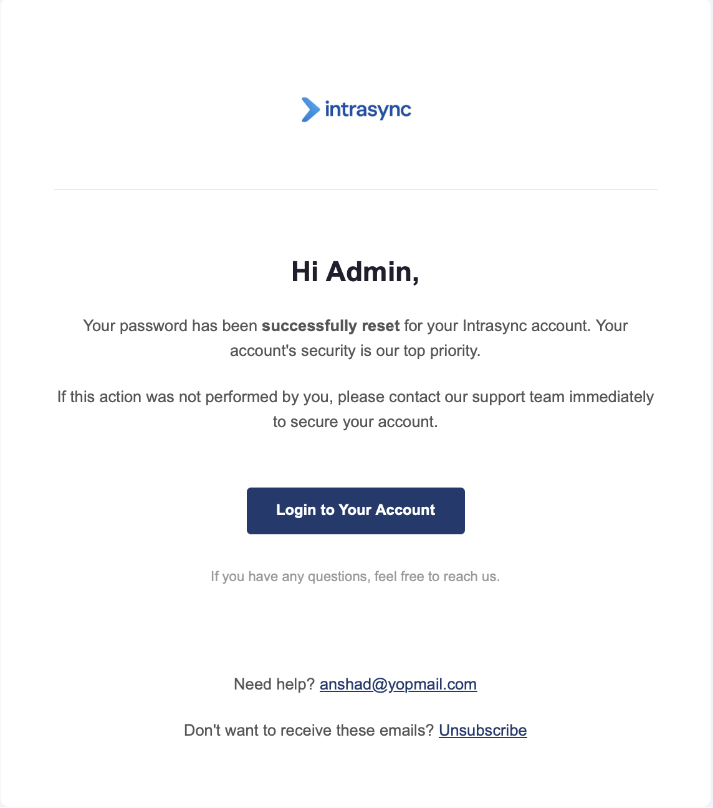

---

## 🤝 Contributing

This is a **private, internal project**. If you're a team member contributing:

-   Follow existing folder and code structure
-   Use meaningful commit messages
-   Create feature branches
-   Submit pull requests with clear descriptions

---

## 📜 License

This project is **not open-source** and is strictly for internal use.  
All rights reserved © by the organization.
